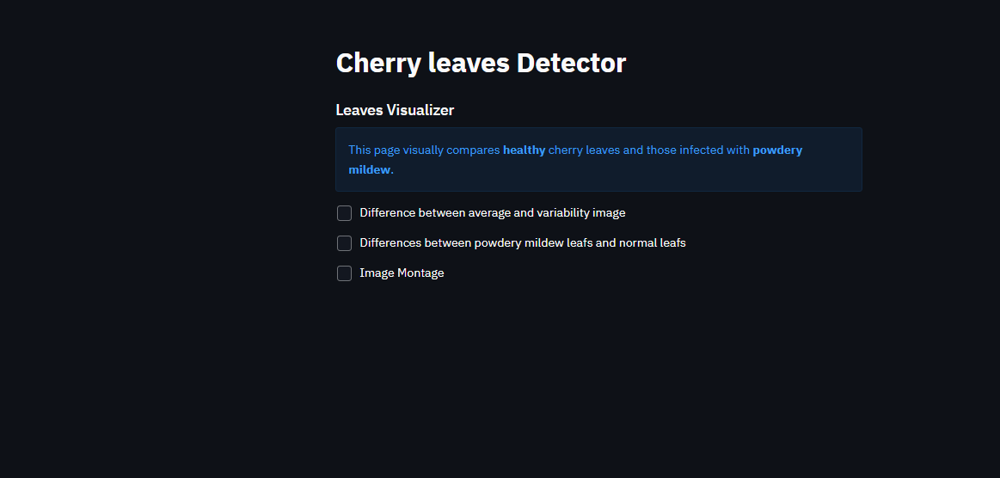

# Cherry Leaves Detector

Powdery mildew detector is an app that can predict if cherry leaves contains powdery mildew or are. The app makes predicts if a leaf is healty or not.

This app is designed based on a supervised, single-label, binary classification ML model. Binary classifier is used to predict the outcome.

[View live project here](https://cherry-leaves-detector-4bfba1113616.herokuapp.com/)

## Dataset Content

- The dataset is sourced from [Kaggle](https://www.kaggle.com/codeinstitute/cherry-leaves). We then created a fictitious user story where predictive analytics can be applied in a real project in the workplace.
- The dataset contains +4 thousand images taken from the client's crop fields. The images show healthy cherry leaves and cherry leaves that have powdery mildew, a fungal disease that affects many plant species. The cherry plantation crop is one of the finest products in their portfolio, and the company is concerned about supplying the market with a compromised quality product.

## Business Requirements

The cherry plantation crop from Farmy & Foods is facing a challenge where their cherry plantations have been presenting powdery mildew. Currently, the process is manual verification if a given cherry tree contains powdery mildew. An employee spends around 30 minutes in each tree, taking a few samples of tree leaves and verifying visually if the leaf tree is healthy or has powdery mildew. If there is powdery mildew, the employee applies a specific compound to kill the fungus. The time spent applying this compound is 1 minute. The company has thousands of cherry trees located on multiple farms across the country. As a result, this manual process is not scalable due to the time spent in the manual process inspection.

To save time in this process, the IT team suggested an ML system that detects instantly, using a leaf tree image, if it is healthy or has powdery mildew. A similar manual process is in place for other crops for detecting pests, and if this initiative is successful, there is a realistic chance to replicate this project for all other crops. The dataset is a collection of cherry leaf images provided by Farmy & Foods, taken from their crops.

- 1 - The client is interested in conducting a study to visually differentiate a healthy cherry leaf from one with powdery mildew.
- 2 - The client is interested in predicting if a cherry leaf is healthy or contains powdery mildew.

## Hypothesis and how to validate?

- A leaf affected by powdery mildew exhibits several features that can differentiate them from healthy ones. Typical characteristics of infected leaf include display of particular marks/signs and morphological changes.  For example, leaves being light in color and roughly-circular. Additional indistinguishable feature is the presence of powder-looking patches on young and susceptible leaves. 

- An Image Montage can define a typical powdery mildew leaf based on the presence of fine white marks. On the other hand, studies based on Average Image, Variability Image, and Difference between Averages didn't reveal any clear pattern to differentiate leaves.

- The ML model will be able to distinguish between a healthy and an infected cherry leaf with at least 97% accuracy.

## The rationale to map the business requirements to the Data Visualisations and ML tasks

## Rationale to map the business requirements to the Data Visualizations and ML tasks

### Business Requirement 1: Data visualisation

- As a  client I want to display the "mean" and "standard deviation" of healthy cherry leaf images and cherry leaves that contain powdery mildew, so that I can visually differentiate both the leaves

- As a client I want to display the difference between an average cherry leaf that is healthy and a cherry leaf infected with powdery mildew, enabling to visually distinguish between them.

- As a client I want to display an image montage for cherry leaves that are healthy and cherry leaves that contain powdery mildew, so that I can visually differentiate cherry leaves.

### Business Requirement 2: Classification of images

- As a client I want to predict if a given cherry leaf is healthy or contains powdery mildew.

- As a client I want to build a ML model and generate reports.

## ML Business Case

- Improved Text:
 - Problem Statement:

- Objective: Develop a supervised binary classification machine learning model to accurately predict the presence of powdery mildew on cherry leaves.
Motivation: Streamline disease detection, reduce manual labor, and enhance cherry plantation management efficiency.
Current Approach: Manual identification is time-consuming and not scalable, taking approximately 30 minutes per tree.
Model Output:

- Target Variable: A binary flag indicating the presence or absence of powdery mildew.
Prediction: The model will output a probability score, with values above a specified threshold indicating the presence of the disease.
Success Metric:

- Accuracy: Target a test set accuracy of 97% or higher.
Business Benefits:

- Improved Product Quality: Early detection of powdery mildew can lead to more effective disease management and higher-quality cherry harvests.
Dataset and Preprocessing:

- Training Data: Utilize the Kaggle dataset containing 4208 images of cherry leaves.
Image Preprocessing: Reduce image dimensions to approximately 100x100 to optimize training time and computational resources.

## Dashboard Design 

### Wireframes

Wireframes have been used for designing the layout of dashboard. Wireframes can be found here:

A dashboard is set to present the models and data to the client.

My dashboard consists of a side navigation bar linking to 5 different pages. The details of the pages are as follows:

#### Page 1: Quick Project Summary

- General Information
   - Powdery mildew is a parasitic fungal disease caused by Podosphaera clandestina in cherry trees. Infected plants display white powdery spots on the leaves and stems. The lower leaves are the most affected.
   
   - Powdery mildew is one of the plant diseases that can be identified easily. As the infection progresses, the spots get larger and denser and it may spread to other parts of plant.
   
   - The disease occurs mostly in high humid and moderate temperatures showing devastating effects on the life of the host plant reducing plant harvest.
   
- Project Dataset

    - The available dataset contains 4208 thousand images taken from different leaves, half infected and half healthy.

- Link to additional information

- Business Requirements

    - The client is interested in conducting a study to visually differentiate a cherry leaf that is healthy and that contains powdery mildew.

    - The client is interested to predict if a cherry leaf is healthy or contains powdery mildew.

#### Page 2: Leaves Visualizer

- Business requirement 1

     - Checkbox 1 - Difference between average and variability image
	 - Checkbox 2 - Difference between average healthy and infected leaves
	 - Checkbox 3 - Image Montage

#### Page 3: Powdery Mildew Detector

- Business requirement 2

     - Link to download a set of healthy and not healthy leaves images for live prediction.
     - User Interface with a file uploader widget. The user should upload leaves images. It will display the image and a prediction statement, indicating if the leaf is healthy or not.
     
     - Table with image name and prediction results.

     - Download button to download table.

#### Page 4: Project Hypothesis and Validation

- This page displays the project hypothesis and the validation.

#### Page 5: ML Performance Metrics

**Label Frequencies for Train, Validation and Test Sets**

•	Train - healthy: 1472 images

•	Train - powdery_mildew: 1472 images

•	Validation - healthy: 210 images

•	Validation - powdery_mildew: 210 images

•	Test - healthy: 422 images

•	Test - powdery_mildew: 422 images

**Model History - Accuracy and Losses**
The graph provide a visual representation of the learning cycle for the ML model. The two graphs show the accuracy and loss plots as a part of the training process.

From these graphs it is evident that it is a normal learning curve. The model is neither overfitting or underfitting.
**Model Evaluation result**
The general accuracy of ML model is 99.88%

The agreed accuracy criteria for the ML model performance with the client is atleast 97% accuracy. The generalized performance of the app is
0.9988.

## Unfixed Bugs

- Initially when I creates an app on Heroku, the stack by default does not support the Python version that I was using, so I had to change the stack of my project from 22 to 20.

- The slug size was a bit to big so i had to add some files in .slugignore file.

## Deployment

### Heroku

- The App live link is: `https://cherry-leaves-detector-4bfba1113616.herokuapp.com/`
- Set the runtime.txt Python version to a [Heroku-20](https://devcenter.heroku.com/articles/python-support#supported-runtimes) stack currently supported version.
- The project was deployed to Heroku using the following steps.

1. Log in to Heroku and create an App
2. At the Deploy tab, select GitHub as the deployment method.
3. Select your repository name and click Search. Once it is found, click Connect.
4. Select the branch you want to deploy, then click Deploy Branch.
5. The deployment process should happen smoothly if all deployment files are fully functional. Click the button Open App on the top of the page to access your App.
6. If the slug size is too large, then add large files not required for the app to the .slugignore file.

## Main Data Analysis and Machine Learning Libraries

### Languages

Python

### Frameworks and other technologies

1. **Git**: Git was used for version control by utilizing the Gitpod terminal to commit to Git and Push to GitHub.

2. **GitHub:** GitHub is used to store the projects code after being pushed from Git.

3. **Balsamiq**: Balsamiq is used to create wireframes.

4. **Heroku**: It is a container-based cloud platform used for deployment.

### Data Analysis and Machine Learning Libraries 

Following are the list of libraries used in the project

1. **Numpy**: A powerful Python library for working with arrays and matrices, offering efficient mathematical operations and linear algebra functions.

2. **Pandas**: A versatile data analysis tool that provides structures like DataFrames for organizing and manipulating data, making it easy to clean, explore, and analyze datasets.

3. **Matplotlib**:  A flexible plotting library that allows you to create various types of visualizations like line plots, scatter plots, histograms, and bar charts to explore and understand data.

4. **Seaborn**: A higher-level data visualization library built on top of Matplotlib, offering a more consistent and aesthetically pleasing style, making it easier to create visually appealing plots.

5. **Plotly**: It is an interactive, open-soource, and browser-based gra6.	Tensorflow: It is an open-sourec machine learning platform focused on deep neural networks.phing library. Used to create visualisations within Jupyter notebooks to present the data.

6. **Tensorflow**: A popular open-source machine learning framework that is widely used for building and training deep neural networks, making it a powerful tool for tasks like image recognition, natural language processing, and predictive modeling.

7. **Shutil**: Used form file copying and removal.

8. **Streamlit**: It is used to create web apps for data science and machine learning.

9. **Joblib**: It is a set of tools  to provide lightweighting pipelining in Python.

10. **PIL**:  A library that adds support for working with images in Python, allowing you to open, manipulate, and save images in various formats.

## Credits

- [Code Institute Malaria Walk Through Project](https://learn.codeinstitute.net/courses/course-v1:code_institute+CI_DA_ML+2021_Q4/courseware/07a3964f7a72407ea3e073542a2955bd/29ae4b4c67ed45a8a97bb9f4dcfa714b/) : The code and design was taken from  Code-Institute-Org/WalkthroughProject01. It helped me alot with understanding the concepts of Machine-learning and i only changed some small parts.

- [GyanShashwat1611/WalkthroughProject01](https://github.com/GyanShashwat1611/WalkthroughProject01) github repository was used for code reference and assistance for in the jupyter notebook set up and for the app page design.

- [alerebal/Powdery Mildew] (https://github.com/Code-Institute-Submissions/milestone-project-mildew-detection-in-cherry-leaves.git) in Cherry Leaves Detector: Readme guidance

### Content

- Streamlit documentation

- Code Institute Lecture and Videos 
